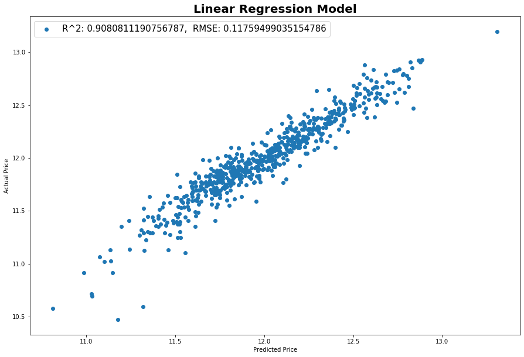
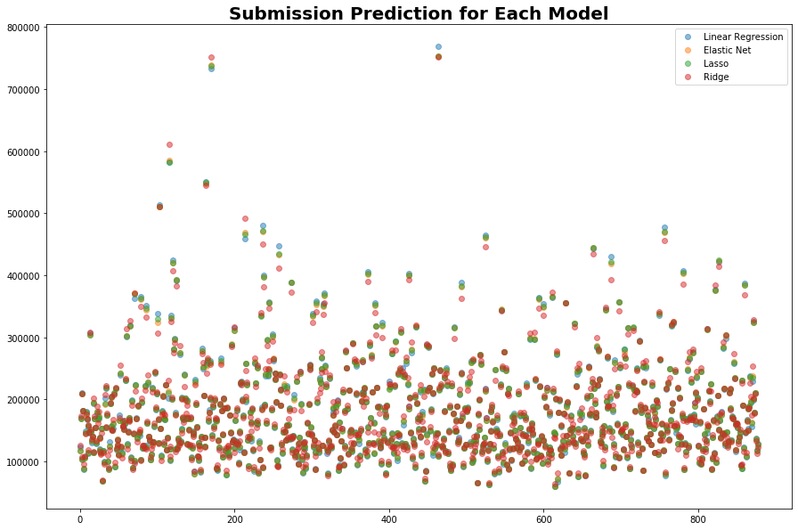

# Project 1: SAT & ACT Analysis

## Table of Contents

[Directory Structure](#Directory-Structure)<br>
[Project Outline / Problem Statement](#Project-Outline-/-Problem-Statement)<br>
[Description of Data](#Description-of-Data)<br>
-[Size](#Size)<br>
-[Source](#Source)<br>
[Data Visualization](#Data-Visualization)<br>
[Conclusion](#Conclusion)<br>
-[Next Steps](#Next-Steps)<br>
[Outside Sources](#Outside-Sources)<br>

## Directory Structure

```
.
├── project_2
    ├── version_1
        ├── 1_eda_cleaning_engineering.ipynb
        ├── 2_modeling.ipynb
        ├── datasets
            ├── train.csv
            ├── test.csv
            ├── train_cleaned.csv
            ├── test_cleaned
            ├── output
                ├── output_elnet.csv
                ├── output_lr.csv
                ├── output_lasso.csv
                ├── output_ridge.csv
    ├── version_2
        ├── ames_housing_data_2.ipynb
    ├── plots
        ├── heatmap_project1.png   
    ├── README.md
    └── ames_housing_project.pdf
```

## Project Outline / Problem Statement

I was provided with Ames Housing Data Set. This was a part of a Kaggle Challenge we did for our project 2. My task was to create a regression model to predict the price of a house based on characteristics of the house. I was allowed to use a Linear Regression, Lasso, Ridge and/or Elastic Net to make my predictions. The success of the model was measured with RMSE. 


---
## Description of Data

A full description of each data feature can be found [here](http://jse.amstat.org/v19n3/decock/DataDocumentation.txt)

### Size

There was 79 features to potentially feed in to our model. They were broken down into Discrete, Nominal, Continuous and Ordinal.


### Source

The source of the data was [Kaggle](https://www.kaggle.com/c/house-prices-advanced-regression-techniques). 


---
## Data Visualization






---
## Conclusion

During the EDA process, it was suggested that the top correlated features with Sale Price are Overall Qual, Total SF, Gr Liv Area, Garage Area, Neighborhood, Bsmt Qual, Exter Qual and Kitchen Qual.

When I ran the different models, intuitevely, going off of EDA, the models that should have performed the best were Ridge and Lasso. I say intuitevely because when looking at the coefficients, the ones for Ridge and Lasso were closer to the EDA suggestions. 

The Linear Regression did well when comparing R^2 for test and train and did well with RMSE. However when looking at the top coefficients they seemed misleading. My Lasso model had the smallest RMSE and was putting a lot of emphasis on Neighborhoods.


### Next Steps

As a next step, to tell which model is the best it would be beneficial to take a completely unseen data set and run all 4 models on it.

It would also be interesting to see how the data performs on different, non-linear, models. Another step would be to try and encode the ordinal features to numerical and nominal to categorical. Unfortunately, when I tried to do this for this project it lowered my R^2 and raised my RMSE significantly enough to where I deserted the idea for now. 

Another interesting question: which test is more beneficial for the student. 

---
## Outside Sources

- [ANOVA example](https://stackoverflow.com/questions/44065573/anova-for-groups-within-a-dataframe-using-scipy)<br>
- [Graphing p-values Example](https://www.biostars.org/p/358046/)<br>
- [Manual Encoding Ex](https://datatofish.com/if-condition-in-pandas-dataframe/)<br>